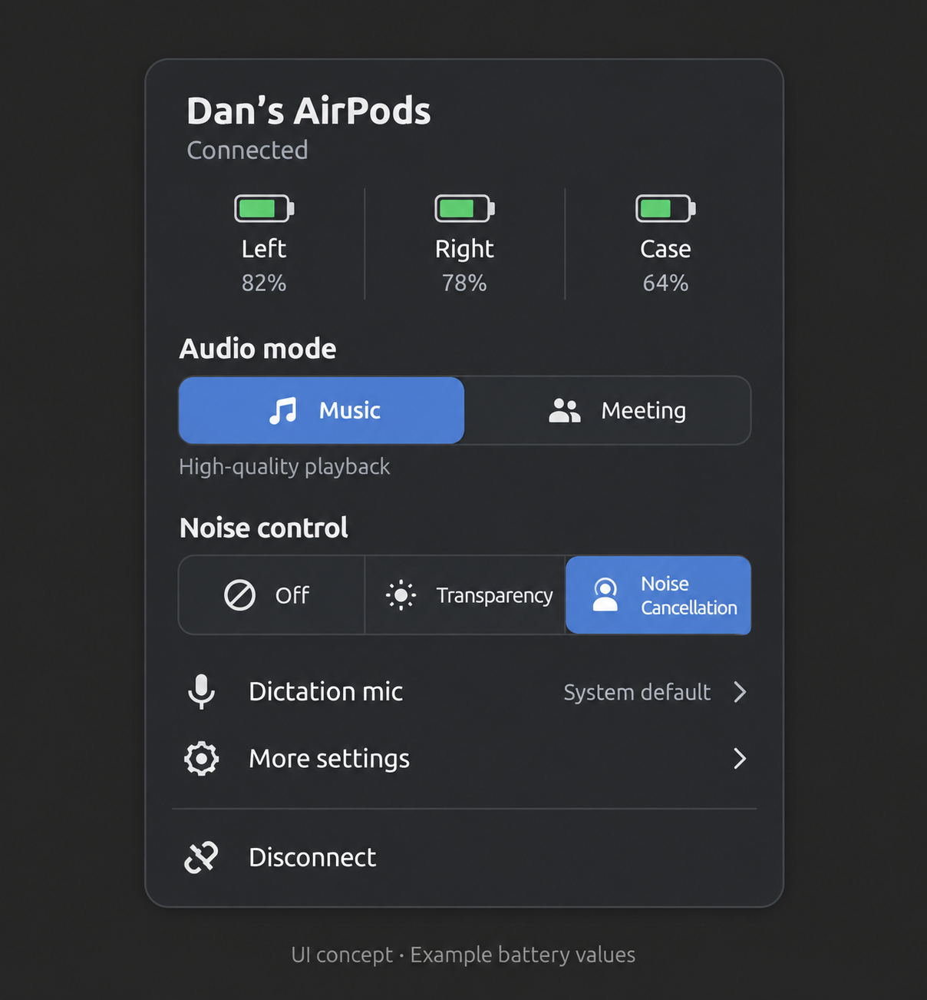

# Native GNOME popup UI and backend contract

UUID: `gnome-airpods-companion@dosment.github.io`; extension files live directly in `extension/`.



*Approved visual concept. It contains example battery values and is **not** a runtime screenshot.*

## Popup presentation

The extension uses a standard `PanelMenu.Button` and `PopupMenu` hierarchy, keeping the control reachable while disconnected. The compact dark popup presents, in order:

1. Bold device title and connected/disconnected or retained-stale status.
2. A three-column Left/Right/Case battery grid (or one headset reading), based only on normalized telemetry. Missing or invalid readings say **Unavailable**; zero is shown only when measured. The main grid is compact (`82%`, `82% · stale`, or `82% · age unknown`); charging, in-ear, and raw freshness detail live in Diagnostics.
3. **Audio mode** heading followed by an inline, two-button native toggle-mode `St.Button` segment group for Music and Meeting. Each `St.Button` is an `St.Bin` with one content `St.BoxLayout` child containing its symbolic icon and label. `checked` is set programmatically from the observed PipeWire profile and restored after a click, so it cannot optimistically represent a requested state. A2DP maps to Music; `headset-head-unit`, HFP, and HSP map to Meeting; unknown profiles select neither. A short “Requested … · observed …” hint appears only while they differ. Modes route playback to AirPods but never set Ubuntu’s default microphone.
4. Capability-gated **Noise control** heading followed by an inline native `St.Button` segment group in visual order Off, Transparency, Noise Cancellation, Adaptive. Selected options use the same scoped muted blue `#458588` state; unavailable capabilities create no button. Configuration choices are non-reactive and cannot receive keyboard focus while busy, disconnected, or stale. A fresh disconnected status still exposes Connect; stale retained status exposes no writes. The controller repeats this gate before constructing argv, not only in styling.
5. **Dictation mic** submenu with a microphone symbolic icon, a source-only summary plus **Restart pending** only when the backend reports it true, literal PipeWire source choices, and launch readback. It never claims a capture was verified or restarts dictation automatically.
6. **More settings** with a gear symbolic icon, which contains only explicitly supported Conversation Awareness, One-Bud ANC, Ear detection, Adaptive level, and nested **Diagnostics**. Reported daemon preferences remain labelled “Reported”; ear behavior remains “Local policy.” Adaptive level stays visible when supported but its values are disabled until observed Adaptive mode permits `adaptive:N`.
7. A separator and Connect/Disconnect footer with a matching network icon. Applying and command errors also receive a brief visible main-menu notice; backend/bridge detail, raw profile/codec/policy strings, full battery telemetry, stale detail, and Refresh status remain in Diagnostics. Menu text is fixed-width/truncated to prevent diagnostic payloads expanding the popup.

The presentation model in `extension/model.js` is GI-free. It keeps requested Music/Meeting state distinct from the observed profile; commands do not change displayed hardware/profile state until status readback. `canAct()` gates both the presentation and controller using the existing literal-argv `commandArgs()` validation, with Connect as the only fresh-disconnected write. Status failures retain prior observations as stale and disable writes. The controller retains its single async subprocess, 15-second deadline, 5-second polling, open-menu refresh, and enable-cycle cleanup behavior. Battery cells use symbolic battery icons derived only from an available integer percentage; unavailable readings use the missing-battery icon and retain the literal **Unavailable** text.

`extension/stylesheet.css` is extension-scoped. It supplies title/status hierarchy, compact card spacing, symbolic battery styling, muted-blue selected-control contrast, notices, fixed-width truncation, and insensitive states without changing the global GNOME theme. Focus uses supported `border` and `box-shadow` properties rather than CSS `outline`; controls use text labels rather than color alone.

## Normalized Apple contract

`apple` contains `available: boolean`, optional `stale: boolean`, `error: string|null`, `battery`, `capabilities`, and `state`. Battery entries are `{available, level, charging, in_ear, stale, freshness}`. Missing data is never fabricated. Capabilities must be explicit: absent flags grant no Apple controls.

Allowed backend verbs remain exactly `noise:off|anc|transparency|adaptive`, `ca:on|off`, `onebud:on|off`, `ear:one|both|off`, and `adaptive:N` (0–100 only while observed Adaptive mode is active). The frontend passes these only as `apple VERB`; no shell interpolation, arbitrary verbs, protocol packets, or backend command-route changes were introduced. A successful ctl command only confirms delivery; state is shown after readback and reported daemon preferences are not represented as hardware confirmation.

## Verification boundary

- `node --test tests/frontend*.test.mjs` covers schema/parser validation, no-invented battery display, observed-profile mapping, no-optimistic toggle restoration, one-child `St.Bin` button content, stale/disconnected action gates, literal argv, timeout/cleanup, diagnostics containment, notices, and mocked controller lifecycle. The controller tests use fakes and are **not** a real Shell load.
- `gjs -m extension/model.js`, `node --check extension/model.js`, and `node --check extension/extension.js` validate the pure module/syntax boundary.
- Installed GNOME Shell resources in `/usr/lib/gnome-shell/libshell-18.so` were inspected: `PopupBaseMenuItem` accepts `style_class`, exposes keyboard focus/sensitivity, and `St.Button`, `PopupMenuItem`, `PopupSubMenuMenuItem`, `PanelMenu`, and extension resource paths are present. This is API inspection, not running-extension verification.

## UI-only extension upgrade and rollback

Install the four extension UI files into a separate, unique state directory:

```bash
python3 scripts/manage-install.py install-extension --state "$HOME/.local/state/gnome-airpods-companion/ui-upgrade-<unique>"
```

Log out and back in before evaluating the change; this process makes no live-reload claim. To roll back the UI-only upgrade, run the corresponding uninstall with the **same** state directory, then log out and back in again:

```bash
python3 scripts/manage-install.py uninstall --state "$HOME/.local/state/gnome-airpods-companion/ui-upgrade-<unique>"
```

Perform this rollback before any original full uninstall, so the UI-only manifest can restore its backups.

No install, enable, GUI automation, audio mutation, hardware-control test, recording test, commit, or push is part of this change. Install through the agreed installer, enable the extension, and have the user verify real Shell layout, keyboard navigation, active profile readback, actual battery/telemetry freshness, supported Apple controls, dictation routing, and disable/re-enable. A first Wayland load may require user-performed logout/login; do not restart Shell through `Alt-F2 r`.
